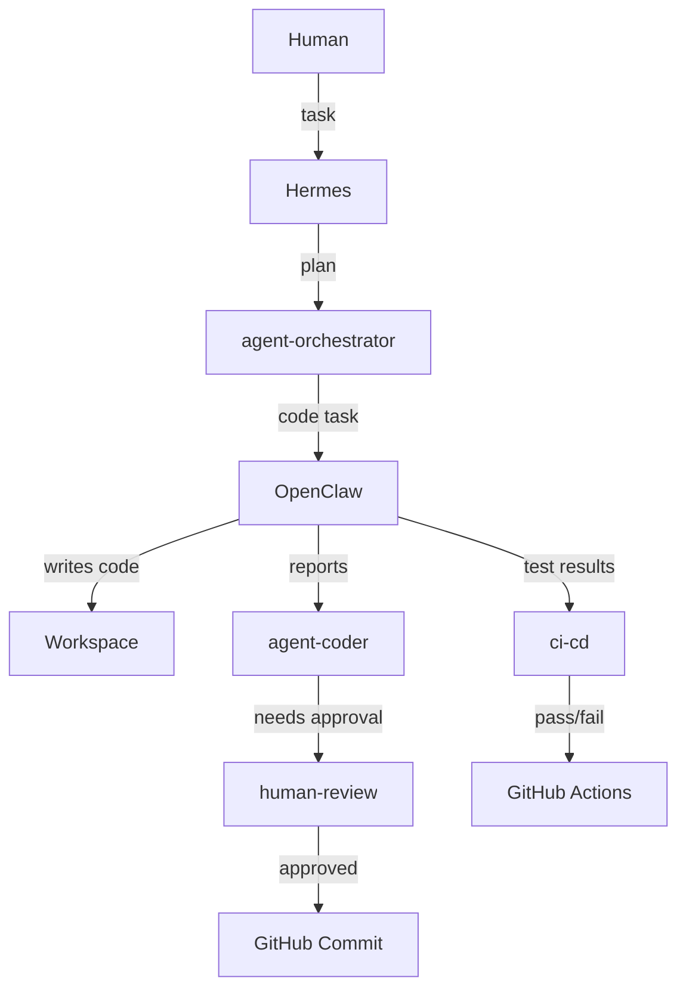

# Forge 2 Edition 1 — Multi-Agent Sprint
**Builder:** Arijit Chowdhury | **Event:** NMG Labs Forge Sprint 02 | **Date:** 27 June 2026

## Agent Stack
| Agent | Role | Model |
|-------|------|-------|
| Hermes | Orchestrator / Planner | gemini-2.5-flash (free) |
| OpenClaw | Coder / Executor | qwen/qwen-2.5-7b-instruct via OpenRouter (free) |

## Architecture

## Slack Channels
- agent-orchestrator — Hermes posts plans and delegates tasks
- agent-coder — OpenClaw receives and executes coding tasks
- human-review — Human approval gate for critical decisions
- ci-cd — Automated test results from GitHub Actions
- agent-log — Full agent activity log

## Setup
1. Copy agents/openclaw.json.example to ~/.openclaw/openclaw.json and fill in your keys
2. Copy agents/hermes.env.example to .env and fill in your keys
3. Start OpenClaw: openclaw gateway
4. Start Hermes: hermes start

## Models Used
- Hermes: gemini-2.5-flash — free tier, Google AI Studio
- OpenClaw: qwen/qwen-2.5-7b-instruct — free tier, OpenRouter

## CI/CD
GitHub Actions runs pytest on every push to main. See .github/workflows/ci.yml

